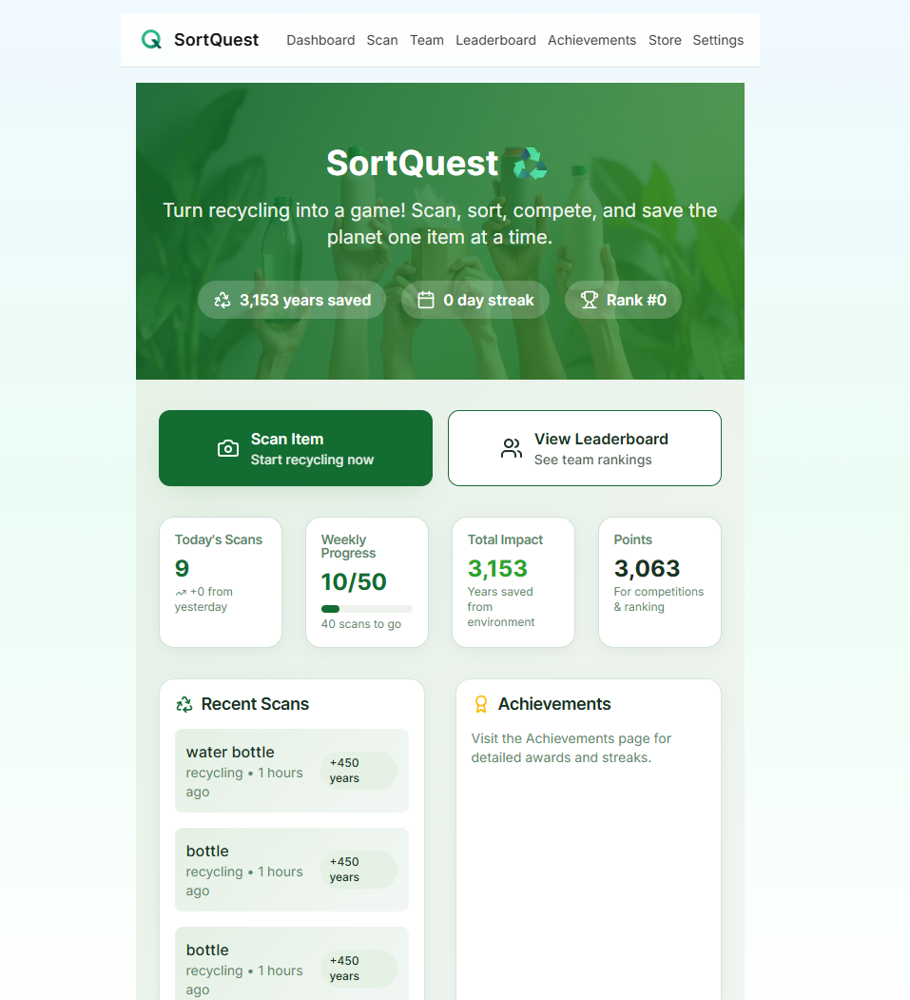
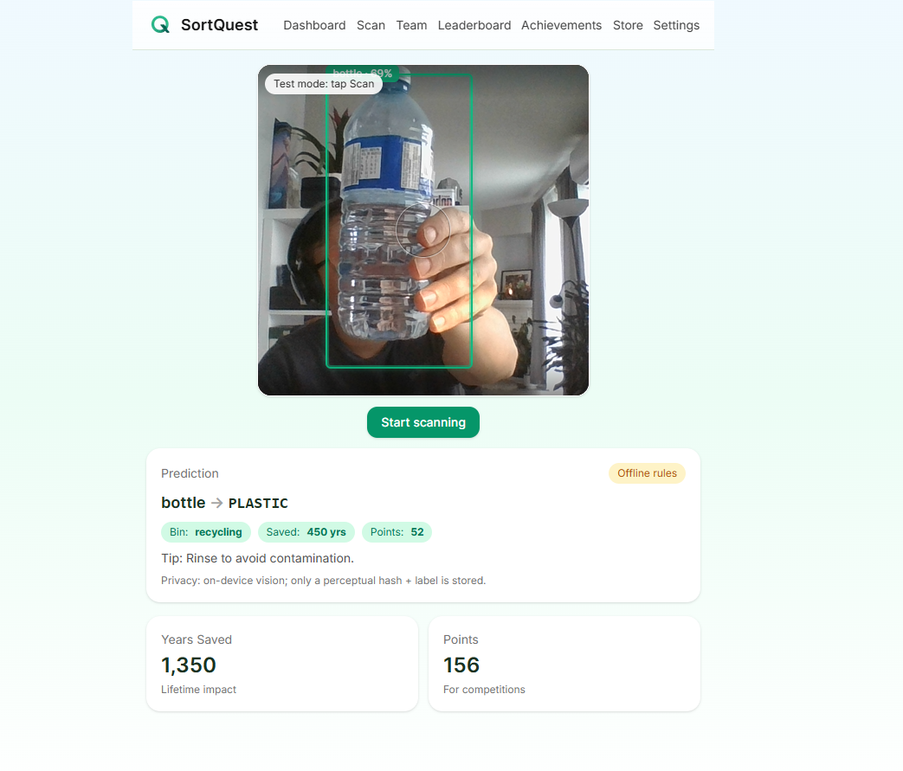
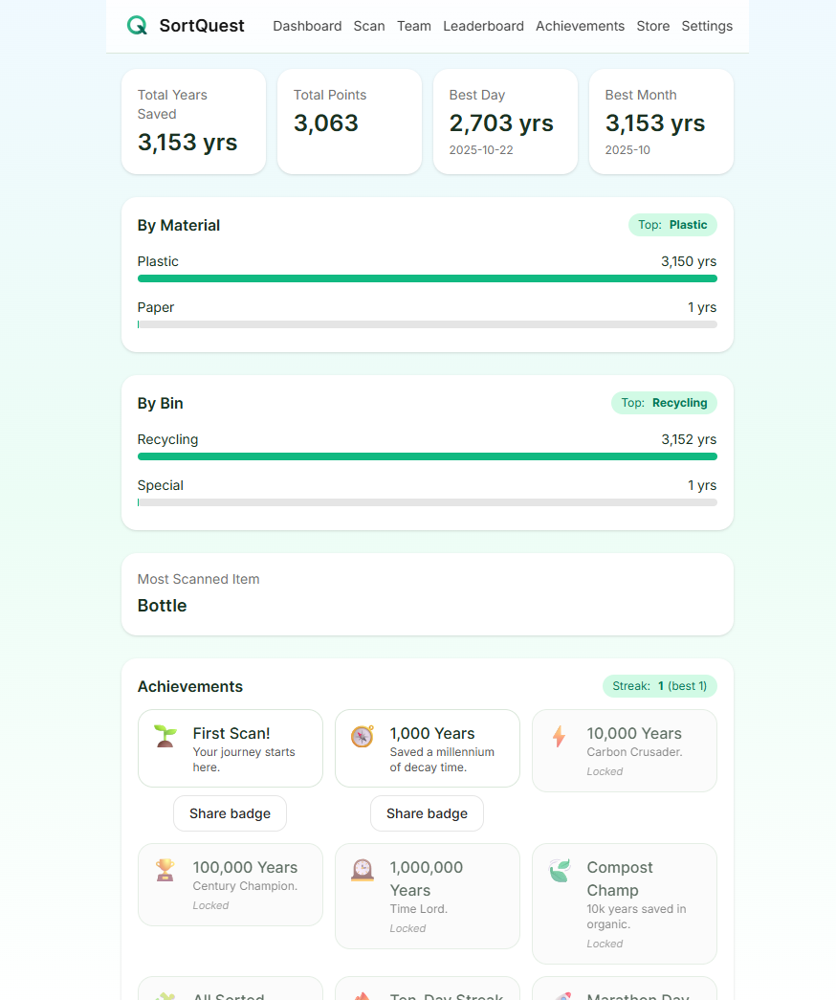

# SortQuest♻️

_Gamified recycling with streaks, badges, and leaderboards._

**SortQuest** turns everyday recycling into a friendly competition. You earn points (and “years saved”) for each correctly sorted item, collect achievements, and compete with other teams — e.g., between schools, organizations, neighborhoods, or offices. The app uses your camera to identify items, tells you the right bin, and totals your environmental impact over time.

---

## Why this matters

Recycling behavior is mostly about **habit & motivation**. Fitness apps made daily movement sticky by adding goals, streaks, badges, and social. SortQuest applies those same mechanics to recycling:

- **Instant feedback**: “This goes to **recycling**. You just saved **450 years** of decomposition time.”
- **Progress**: See your lifetime impact (“**137,420 years saved**”), streaks, and personal records.
- **Competition**: Team up with friends or classmates; climb the leaderboard.
- **Trust**: A QR **BinTag** next to your bin plus built-in anti-cheat signals keep things fair.

---

## Features

- **Scan → Classify → Score**
  Aim your camera at an item **with your BinTag QR in frame**. The app identifies it (e.g., “plastic bottle”), maps it to local rules, and shows the correct bin + “years saved”.
- **AI-powered guidance**
  On-device MobileNet suggests item labels; a server route calls an LLM to map those labels to your **local recycling rules** and a helpful tip. Falls back to a deterministic rules engine if offline.
- **Points & “Years Saved”**
  Every correctly sorted item awards points and “years saved” (time the item would otherwise sit in the environment).
- **Achievements**
  First Scan, 1k/10k/100k/1M years saved, Category Hero (e.g., 10k Organic), “All Categories”, Daily/Weekly streaks, “Power Hour”, etc.
- **Leaderboards**
  Daily + All-time boards for teams (schools, offices, neighborhoods).
- **Anti-cheat**
  Enforces: QR present, motion threshold, perceptual-hash near-duplicate check, hourly caps, and a risk score that can reduce points on suspicious scans.
- **Privacy-first**
  Only a perceptual hash & label are stored—**no photos**.

---

## Points System

We use a capped, log-scaled impact with material multipliers and small modifiers to keep scores fair and not dominated by extreme “years” values:

- **Material multiplier (harm/priority)**
  - plastic: 1.3, aluminum: 1.6, e-waste: 2.0, battery: 2.5, glass: 0.8, paper: 0.6, compost: 0.5
- **Impact from years (diminish extremes)**
  - `impact = clamp(1, 10, 3 * log10(years + 1))`
- **Risk incentive (harder ≈ more points)**
  - `riskAdj = 1 + 0.5 * risk_score`
- **Anti-farm (soft diminishing returns per bin/day)**
  - `freqAdj = 1 - 0.1 * min(nToday, 5)`
- **Final**
  - `points = round(clamp(1, 100, 5 * impact * materialMult * riskAdj * freqAdj))`

Examples:

- Plastic bottle (450y, plastic 1.3, risk 0.3, first): ~60 pts
- Glass bottle (1500y, glass 0.8, risk 0.1, first): ~40 pts

---





## Tech Stack

- **Framework**: Next.js 15 (App Router, `src/app`)
- **UI**: Tailwind CSS **v3** (pinned for stability with Next 15)
- **Auth**: Firebase **Anonymous Auth**
- **Database**: Firebase **Firestore**
- **On-device vision**: `@tensorflow-models/mobilenet` (TFJS)
- **QR**: `jsQR`
- **AI Recognition**: AWS Bedrock **Nova Lite** for advanced computer vision
- **PWA**: Installable, mobile-first layout

---

## Architecture Diagram

See `ARCHITECTURE.md` for the full Mermaid diagram. Rendered image:



---

## How it works (User flow)

1. **Create a Team**
   In the app, create a team (e.g., “Green Tigers”).
2. **Get your BinTag**
   The app generates a unique **QR code** for your team/bin. Print it and tape it on/near your recycling bin.
3. **Scan items**
   Open **Scan**, aim your camera at the item **with the BinTag visible** in the frame.
4. **Get sorting guidance**
   The app shows: bin type (recycling/compost/landfill/special), a quick **tip**, and **years saved**.
5. **Earn points**
   Your team’s score and leaderboard position update automatically.
6. **Spend you Points**
   Get unique Wallpapers, avatars, perks and discounts from sponsors.
7. **Track impact**
   See your history, best days, category totals (organic, plastic, etc.), and achievements.

---

## Data Model (Firestore)

- `teams`

  - `name`, `createdAt`

- `bins`

  - `teamId`, `label`, `createdAt`

- `scans`

  - `userId`, `teamId`, `binId`, `ts`
  - `label` (e.g., “plastic bottle”), `material` (normalized category)
  - `binSuggested`, `years`, `points`, `confidence`, `recyclable`
  - `ahash` (perceptual hash for dupe detection)
  - `llmMode` (`server` | `heuristic`), `llmModel`, `risk_score`

> Default queries avoid composite indexes; everything works out of the box.

---

## Getting Started

### 0) Prerequisites

- **Node**: 18+ (20 recommended)
- **npm**: 9+
- A **Firebase** project with Firestore enabled
- An **AWS Bedrock** API key for advanced AI recognition

### 1) Clone & Install

```bash
git clone https://github.com/mr-Arturio/SortQuest.git
cd SortQuest
npm i
```

### 2) Tailwind v3 (pinned)

pin Tailwind to v3 to avoid Next 15/v4 PostCSS changes.

```bash
npm ls tailwindcss postcss autoprefixer
# should show tailwindcss 3.x, postcss 8.x, autoprefixer 10.x
```

`postcss.config.js`:

```js
module.exports = {
  plugins: {
    tailwindcss: {},
    autoprefixer: {},
  },
};
```

`tailwind.config.js` includes your `src/**/*.{ts,tsx}`.

### 3) Firebase Setup

1. In Firebase Console: Create project → Enable **Firestore**.
2. Create a **Web App** → copy the web config.
3. Put your config in `src/lib/firebase.ts` (already scaffolded in the code you have):

   ```ts
   const firebaseConfig = {
     apiKey: "…",
     authDomain: "…",
     projectId: "…",
     storageBucket: "…",
     messagingSenderId: "…",
     appId: "…",
   };
   ```

4. Firestore security for hackathon/demo: start with **test rules** or simple allow rules, then harden later.

### 4) AWS Bedrock Configuration

Create `.env.local` at project root:

```ini
AWS_BEARER_TOKEN_BEDROCK=your_bedrock_token  # required for AI recognition
AWS_REGION=us-east-1                         # AWS region
BEDROCK_VISION_MODEL_ID=amazon.nova-lite-v1:0  # vision model
```

- The app uses **AWS Bedrock Nova** for advanced computer vision recognition.
- Falls back to client-side heuristics if Bedrock is unavailable.

### 5) Icons (PWA)

Replace placeholders:

```
public/icons/icon-192.png   # 192x192
public/icons/icon-512.png   # 512x512
```

### 6) Run

```bash
npm run dev
# open http://localhost:3000
```

> **Camera permissions**: Browsers allow camera on `https` or `http://localhost`. If the camera doesn’t appear, check site permissions and that no other app is using the camera.

---

## Verifying the AI route (optional)

From **PowerShell** on Windows:

```powershell
$body = @{
  labels = @(@{ name = "plastic bottle"; prob = 0.93 })
  rules  = @{ plastic = @{ bin = "recycling"; years = 450; tip = "Rinse and recycle." } }
  meta   = @{ recentCount = 0; delta = 0.3; conf = 0.93 }
} | ConvertTo-Json -Depth 5

$r = Invoke-WebRequest -Uri "http://localhost:3000/api/map" -Method POST -ContentType "application/json" -Body $body
$r.Headers["x-map-mode"]     # "server" if using Bedrock, else "heuristic"
$r.Headers["x-map-model"]    # "bedrock-nova" (if server)
$r.Content | ConvertFrom-Json | ConvertTo-Json -Depth 5
```

---

## Using the App (Demo Instructions)

1. **Create / Join a Team**

   - Go to **Team** → type a name → **Create**.
   - App stores your team/bin IDs locally for convenience.

2. **Print your BinTag**

   - The **QR badge** is shown under your team. Print/tape it near your bin.

3. **Scan Items**

   - Go to **Scan** → tap **Start 90s Session**.
   - Scan the **BinTag** QR - scanning session started
   - Hold the **item** and it will be scanned automaticaly (in demo mode there is a button to scan items)
   - The app will identify the item, suggest the correct bin, award points, and show “years saved”.

4. **View Leaderboard & History**

   - **Leaderboard**: See daily and all-time scores per team.
   - **My Scans**: Your last scans with materials, bins, dates, and impact.

5. **Achievements**

   - Earn badges for milestones (first scan, 1k/10k/100k/1M years, category awards, streaks).

6. **Store** (coming soon) - where user can exchange point for digital items - wallpapers, avatars, some collaborated promotions possible.

---

## Anti-Cheat Signals

- **BinTag required**: QR must be present to score.
- **Motion threshold**: Low motion prompt prevents static “spam scans”.
- **Perceptual hash**: Near-duplicate frames in the same session are rejected (Hamming check).
- **Rate limit**: Per-bin hourly cap.
- **Risk score**: Suspicious scans (low motion, repeats, high volume, low confidence) get a **reduced score**.
- **GeoLocation**

---

## Privacy

- **No photos stored.** Only a **perceptual hash** (a short fingerprint), a label, and aggregate stats.
- Intended for **education & engagement**, not enforcement.

---

## Roadmap

- **Local Rule Packs**: City/region-specific policies and materials (LLM picks by location or user-selected “policy profile”).
- **Model upgrades**: Fewer “unknowns”, better disambiguation (e.g., plastic types, coated paper, compostable plastics).
- **Group Recycling**: Shared bins per class/household with role-based access and moderation tools.
- **Community & Social**: Neighborhood challenges, school districts, sponsors, and seasonal events.
- **Advanced Achievements**: Themed badges, shareable images, “power hour”, “zero contamination” streaks.
- **Sponsor Perks**: Local businesses reward milestones (discounts, coupons, entries).
- **Bulk / Batch Mode**: Guided multi-item capture with smart deduping.
- **Offline-first**: Cache rule packs; queue scans while offline.
- **Carbon Extensions**: Estimate emissions avoided; partner with drop-off centers or MRFs for verified scans.

---

## Taglines

- Quest. Sort. Score.
- Make every toss count.
- Sorting, gamified.
- Small scans. Big wins.
- From trash to triumph.

## Troubleshooting

- **Tailwind errors (`@tailwind base/components/utilities`)**
  Ensure Tailwind **v3** and the standard `postcss.config.js` (see above).
- **Camera not working**
  Use Chrome/Edge/Safari; allow camera permissions; close other apps using the camera.
- **Bedrock recognition not working**
  Check `.env.local`, restart `npm run dev`, confirm AWS credentials are set, and test `/api/bedrock-ping`.
- **Performance**
  Lighting matters. Keep item and QR in frame; avoid glare; move slightly to pass the motion check.

---

## Scripts

```bash
npm run dev        # start local dev
npm run build      # production build
npm run start      # start prod server
```

Deploy to Vercel/Netlify/Render as a standard Next.js app (remember to add your **env vars** and **Firebase origins**).

---

## License
